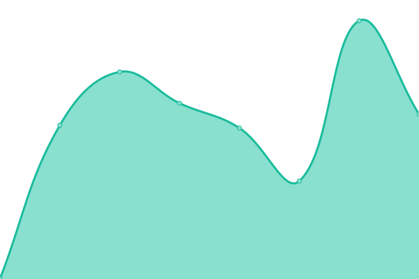

# [📈 Live Status](https://status.tictactrip.eu): <!--live status--> **🟩 All systems operational**

This repository contains the open-source uptime monitor and status page for [Tictactrip](https://www.tictactrip.eu), powered by [Upptime](https://github.com/upptime/upptime).

With [Upptime](https://upptime.js.org), you can get your own unlimited and free uptime monitor and status page, powered entirely by a GitHub repository. We use [Issues](https://github.com/tictactrip/status/issues) as incident reports, [Actions](https://github.com/tictactrip/status/actions) as uptime monitors, and [Pages](https://status.tictactrip.eu) for the status page.

<!--start: status pages-->
<!-- This summary is generated by Upptime (https://github.com/upptime/upptime) -->
<!-- Do not edit this manually, your changes will be overwritten -->
<!-- prettier-ignore -->
| URL | Status | History | Response Time | Uptime |
| --- | ------ | ------- | ------------- | ------ |
|  [Website](https://www.tictactrip.eu) | 🟩 Up | [website.yml](https://github.com/tictactrip/status/commits/HEAD/history/website.yml) | 

 659ms
     
 | 

<a href="https://status.tictactrip.eu/history/website">100.00%</a>
    

|  [Blog](https://www.tictactrip.eu/blog) | 🟩 Up | [blog.yml](https://github.com/tictactrip/status/commits/HEAD/history/blog.yml) | 

 754ms
     
 | 

<a href="https://status.tictactrip.eu/history/blog">100.00%</a>
    

|  [API](https://api.tictactrip.eu/apistatus/maintenance) | 🟩 Up | [api.yml](https://github.com/tictactrip/status/commits/HEAD/history/api.yml) | 

 562ms
     
 | 

<a href="https://status.tictactrip.eu/history/api">100.00%</a>
    

<!--end: status pages-->

[**Visit our status website →**](https://status.tictactrip.eu)

## 📄 License

- Powered by: [Upptime](https://github.com/upptime/upptime)
- Code: [MIT](./LICENSE) © [Tictactrip](https://www.tictactrip.eu)
- Data in the `./history` directory: [Open Database License](https://opendatacommons.org/licenses/odbl/1-0/)
